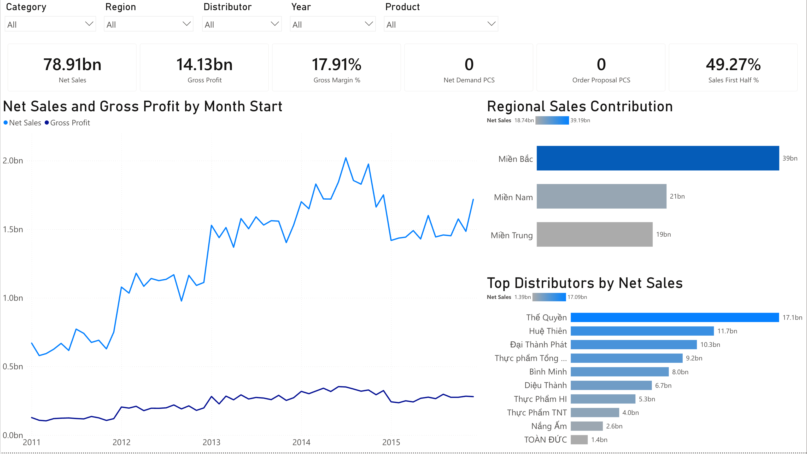
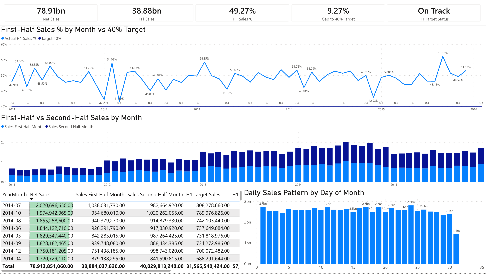

# Supply Chain Planning Control Tower

## Demand Review, Stock Rebalancing & Revenue Phasing Dashboard

### Project Overview

This project is a Power BI supply chain planning dashboard designed to support demand review, inventory visibility, stock cover monitoring, stock rebalancing, and revenue phasing follow-up.

The dashboard was built as a portfolio project aligned with a Supply Chain Intern role. The objective is not only to visualize sales data, but also to connect business performance with supply chain planning actions.

---

## Business Questions

This dashboard answers the following questions:

1. Which regions, distributors, categories, and SKUs drive sales performance?
2. Which SKUs should be prioritized for demand review?
3. Are there any understock or overstock risks?
4. Is replenishment required based on current stock cover and net demand?
5. Which products or distributors require stock rebalancing actions?
6. Is revenue phased properly across the month?
7. Are first-half-month sales meeting the 40% phasing target?

---

## Dashboard Pages

### Page 1 — Executive Control Tower

Provides a high-level view of sales, profit, gross margin, net demand, order proposal, and first-half-month sales performance.

---

### Page 2 — Demand & Revenue Drivers

Identifies key sales contributors by category, product, area, customer segment, and region.

---

### Page 3 — Inventory Health & Stock Cover

Monitors stock cover, understock risk, overstock risk, incoming stock, and distributor-SKU inventory condition.

---

### Page 4 — Stock Rebalancing & Allocation Readiness

Converts inventory insights into planning actions by identifying high-surplus SKUs and distributor stock imbalance.

---

### Page 5 — Revenue Phasing & Invoicing Follow-up

Tracks first-half-month sales performance against a 40% target and analyzes daily sales patterns.

---

## Key Insights

- Total Net Sales reached 78.91bn.
- Gross Profit reached 14.13bn.
- Gross Margin was 17.91%.
- F&B was the largest revenue contributor, accounting for around 42% of total sales.
- The dashboard identified 29 overstock SKUs and 0 understock SKUs under the selected stock cover logic.
- Net Demand and Order Proposal were both 0, indicating no immediate replenishment requirement.
- Stock Surplus was approximately 3.41M PCS, suggesting that the main planning action should focus on overstock review and stock rebalancing.
- H1 Sales % was 49.27%, above the 40% target, indicating that revenue phasing was On Track.

---

## Tools & Skills Used

- Power BI Web
- Power Query
- DAX Measures
- Data Modeling
- Dashboard Design
- Supply Chain Planning Logic
- Inventory & Stock Cover Analysis
- Revenue Phasing Analysis

---

## Data Limitation

The available dataset does not include actual Bill of Lading linking status, stock-in-transit details, or customer inventory at a transactional level.

Therefore, BL linking impact and more advanced net demand logic are listed as future improvements.

---

## Future Improvements

- Add stock-in-transit and customer inventory data to improve net demand accuracy.
- Add Bill of Lading status to analyze invoicing performance drivers.
- Build automated replenishment proposal templates by distributor-SKU.
- Add scenario planning for different stock cover targets.
- Add exportable planning action lists for operational follow-up.
