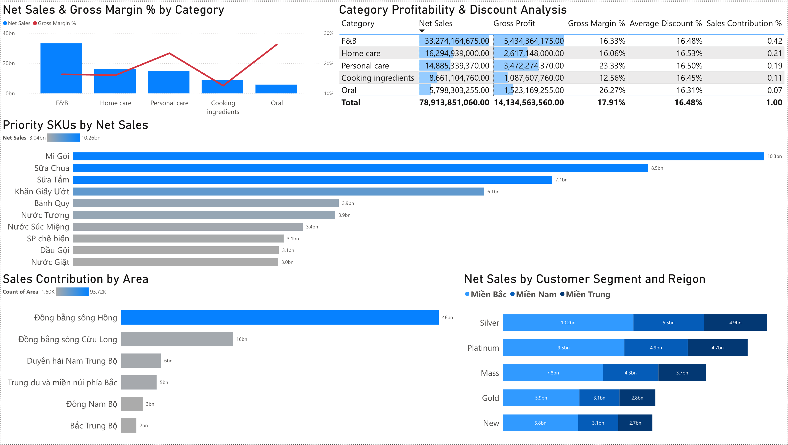
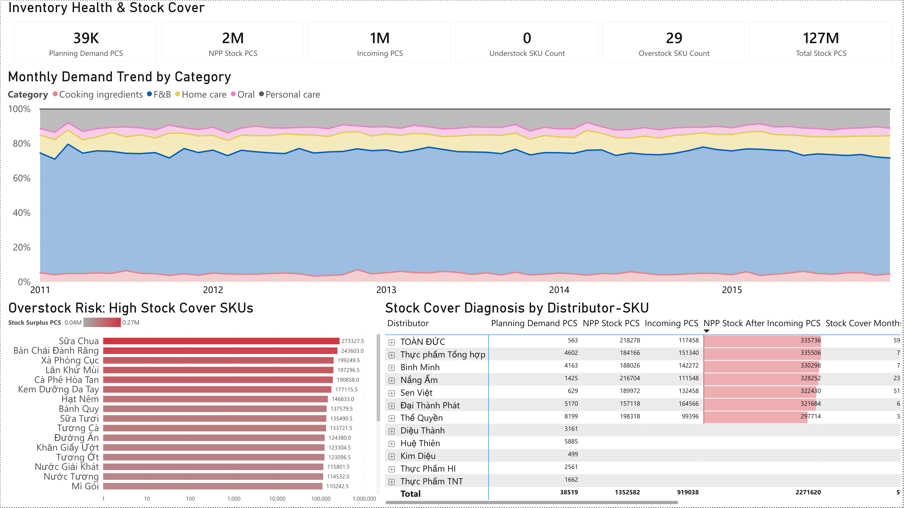
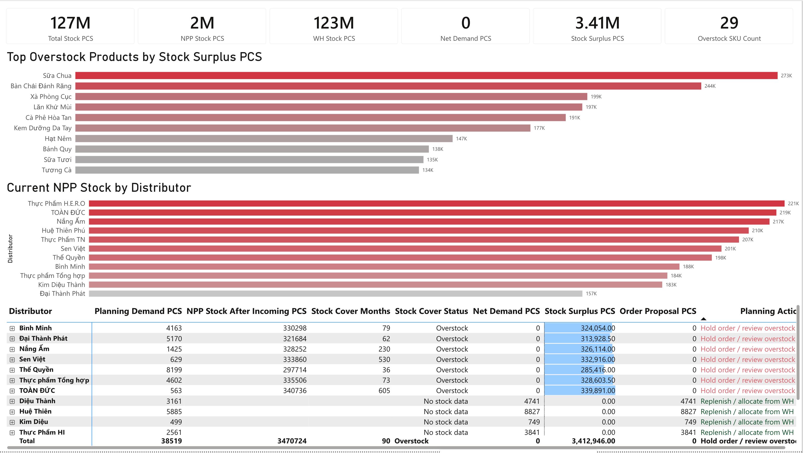

# Supply Chain Planning Control Tower  
### Demand Review, Stock Rebalancing & Revenue Phasing Dashboard

## Project Overview
This project is a Power BI supply chain planning dashboard designed to support demand review, inventory visibility, stock cover monitoring, replenishment decision-making, stock rebalancing, and revenue phasing follow-up.

The dashboard was built as a portfolio project aligned with a Supply Chain Intern role. The main objective is not only to visualize sales data, but to connect commercial performance with supply chain planning actions such as monitoring stock cover, identifying overstock risks, reviewing net demand, and tracking first-half-month revenue phasing against a 40% target.

For a detailed business explanation of this dashboard, please read: [Project Insights](docs/project-insights.md)

## Business Questions
1. Which categories, products, regions, and distributors drive sales performance?
2. Which SKUs should be prioritized for demand review?
3. Are there any understock or overstock risks?
4. Is replenishment required based on stock cover and net demand logic?
5. Which products or distributors require stock rebalancing actions?
6. Is revenue phased properly across the month?
7. Are first-half-month sales meeting the 40% phasing target?

## Dashboard Pages

### Page 1 — Executive Control Tower
Provides a high-level overview of Net Sales, Gross Profit, Gross Margin %, Net Demand, Order Proposal, and H1 Sales %.  
It helps users quickly understand business performance and planning status.

### Page 2 — Demand & Revenue Drivers
Identifies key sales contributors by category, SKU, area, customer segment, and region.  
This page supports demand planning prioritization by highlighting important products and markets.

### Page 3 — Inventory Health & Stock Cover
Monitors stock cover, understock/overstock risk, incoming stock, and distributor-SKU inventory condition.  
The current dataset indicates that the main inventory issue is overstock rather than shortage.

### Page 4 — Stock Rebalancing & Allocation Readiness
Converts inventory insights into planning actions.  
Since current Net Demand and Order Proposal are zero, the recommended action is to hold unnecessary replenishment, review high-surplus SKUs, and monitor stock rebalancing opportunities.

### Page 5 — Revenue Phasing & Invoicing Follow-up
Tracks first-half-month sales performance against a 40% target, compares first-half vs second-half sales, and analyzes daily sales patterns to identify potential end-of-month skew.

## Key Insights
- Total Net Sales reached 78.91bn with Gross Profit of 14.13bn and Gross Margin of 17.91%.
- F&B is the largest revenue contributor, accounting for approximately 42% of total sales.
- The dashboard identifies 29 overstock SKUs and 0 understock SKUs under the selected stock cover logic.
- Net Demand and Order Proposal are currently zero, indicating no immediate replenishment requirement.
- Stock Surplus is approximately 3.41M PCS, suggesting that the key planning action should focus on overstock review and stock rebalancing.
- H1 Sales % is 49.27%, which is above the 40% target, indicating that revenue phasing is currently On Track.

## Tools & Skills Used
- Power BI Web
- Power Query
- DAX Measures
- Data Modeling
- Dashboard Design
- Supply Chain Planning Logic
- Inventory & Stock Cover Analysis
- Revenue Phasing Analysis

## Key DAX Logic
The dashboard uses DAX measures to calculate:
- Net Sales
- Gross Profit
- Gross Margin %
- Planning Demand PCS
- NPP Stock PCS
- Incoming PCS
- Stock Cover Months
- Net Demand PCS
- Stock Surplus PCS
- Order Proposal PCS
- H1 Sales %
- Gap to 40% Target
- H1 Target Status

## Data Limitation
The available dataset does not include actual Bill of Lading linking status, stock-in-transit details, or customer inventory at a transactional level. Therefore, BL linking impact is listed as a future enhancement. With additional shipment and document-linking data, the dashboard can be expanded to analyze invoicing delays and root causes more accurately.

## Future Improvements
- Add stock-in-transit and customer inventory data to improve Net Demand accuracy.
- Add Bill of Lading status to analyze invoicing performance drivers.
- Build automated replenishment proposal templates by distributor-SKU.
- Add scenario planning for different stock cover targets.
- Add exportable action lists for planning follow-up.
